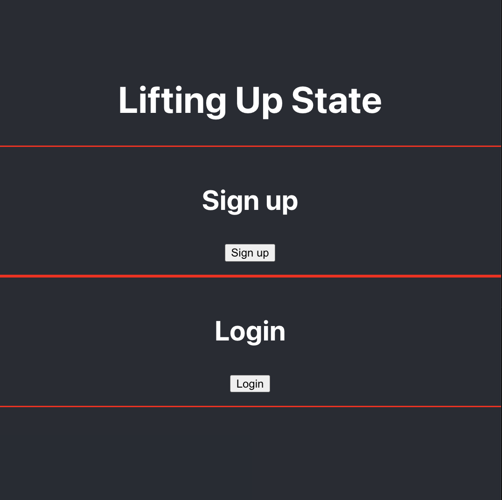

# Lifting State

Boca Code Week 5 Lifting State: This project focuses on the concept of lifting state in React, where state is managed and shared between multiple components.

## Features

- Demonstrates the use of lifting state technique in React applications.
- Illustrates the sharing of state between parent and child components.
- Highlights the advantages of centralizing and managing state at a higher level.

## Technologies and Libraries Utilized

- React
- React Bootstrap
- CSS
- Javascript

## Special Thanks

Special thanks to [Boca Code](https://github.com/bocacode). We appreciate their support in helping us deepen our understanding of lifting state in React applications.

---

*This project was developed as part of the Boca Code curriculum.*
